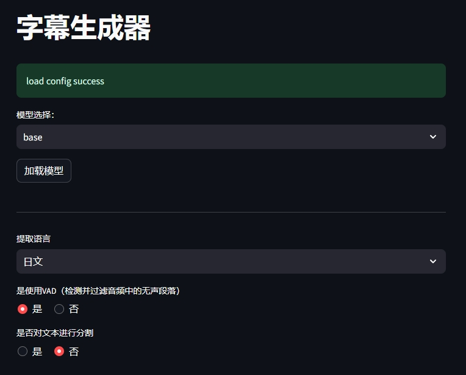
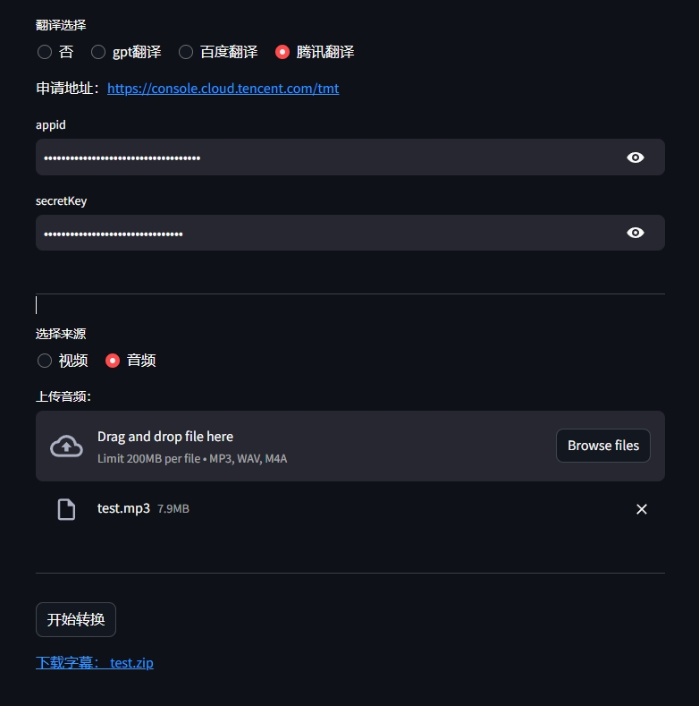

# 字幕生成器

使用faster-whisper本地模型提取音频，生成srt和ass字幕文件。支持gpt等在线翻译，生成翻译后字幕文件。

## 功能

* 音频提取
* 视频提取
* srt字幕
* ass字幕
* gpt字幕翻译
* 百度字幕翻译
* 腾讯字幕翻译


## 环境

* torch（CUDA 11.8，其他版本去[官网](https://pytorch.org/get-started/locally/)找）
    ```bash
    pip install torch torchvision torchaudio --index-url https://download.pytorch.org/whl/cu118
    ```

* 安装ffmpeg。
    去[官网](https://ffmpeg.org/download.html#build-windows)下载，解压后将bin目录添加到环境变量，ubuntu可以直接apt安装。
    然后安装ffmpeg-python
    ```bash
    pip install ffmpeg-python
    ```

* 其他依赖
    ```
    pip install regex
    pip install faster-whisper
    pip install streamlit
    pip install openai>=1.8.0
    pip install pysubs2
    pip install -i https://mirrors.tencent.com/pypi/simple/ --upgrade tencentcloud-sdk-python
    ```


## 模型下载

可以在huggingface上下载模型：[faster-whisper](https://huggingface.co/collections/guillaumekln/faster-whisper-64f9c349b3115b4f51434976)，然后将模型放如models目录下。
也可以直接运行，这样会自动下载模型，但会被保存到你的huggingface缓存目录

目前支持的模型有：
* tiny
* base
* medium
* small
* large-v2
* large-v3
* tiny.en
* base.en
* medium.en
* small.en

## 运行

```bash
streamlit run web.py --server.port 1234
```

[](./file/demonstration_video.webm)



## 效果

### 葬送的芙莉蓮 OP 主題曲 -「勇者」/ YOASOBI

|识别出的歌词|本软件输出|
|---|---|
|まるでおとぎの話 終わり迎えた証|就像童话故事迎来了结局的证明|
|長すぎる旅路から 切り出した一節|从过长的旅程中切出的一节|
|それはかつてこの地に 影を落とした悪を|那是曾经在这片土地上投下阴影的恶|
|打ち取る自由者との 短い旅の記憶 | 是与击败自由者的短暂旅行的记忆|
|物語は終わり 勇者は眠りにつく | 故事结束了 勇者已经入睡|
|穏やかな日常を この地に残して | 留下了平静的日常在这片土地上|
|時の眺めは無情に 人を忘れさせる | 时间的眺望无情地让人忘记|
|そこに生きた奇跡も 錆びついてく | 在那里生活的奇迹也开始生锈了|
|それでも君は 生きてる | 但是你依然活着|
|君の言葉も 願いも 勇気も | 你的话语 你的愿望 你的勇气|
|今は確かに私の中で 生きてる | 现在它们确实在我心中活着|
|同じ道を選んだ それだけだった | 只是选择了相同的道路|


## 参考

* [faster-whisper](https://github.com/SYSTRAN/faster-whisper)
* [N46Whisper](https://github.com/Ayanaminn/N46Whisper/blob/main/README_CN.md)